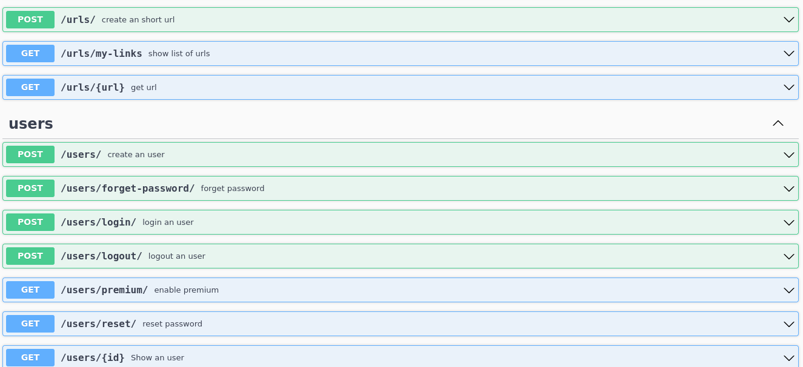

# url-shortener

## About 

* url-shortener t is a free tool to shorten a URL or reduce a link
Use our URL Shortener to create a shortened link making it easy to remember

## Table of contents

> * [Url-shortener](#url-shortener)
>   * [Installation](#installation)
>   * [Usage](#usage)
>     * [Screenshots](#screenshots)
>   * [Code](#code)
>     * [Requirements](#requirements)
>     * [Build](#build)
>   * [Contributing / Reporting issues](#contributing--reporting-issues)
>   * [License](#license)

### Screenshot

### Features
- Email and SMS service for forgetting user password
- log system with zap
- jwt for authentication
- api documentation (swagger)

## Descreaption
This service using echo-framework and gorm  as web framework and ORM system. I use mysql database for store users and urls data and redis for store tokens. for sending SMS I use an external api [Trez sms service](http://smspanel.trez.ir/) and for sending emails I use stmp library that is a standard library of golang. all logs are stored in service.log file that create by zap library, you can change the logger config by edit zap.config in logger directory.

## Installation

### Requirements
- go >=1.5
- mysql
- redis-server

before running the service you should set some environment variables in your systems

- *TREZ_PHONENUMBER (phonenumber service that you buy from trez.ir)
- *TREZ_PASS (your password in trez.ir)
- *my_sql_password
- REFRESH_SECRET (a secret key for refresh token if not set default is foo)
- ACCESS_SECRET (a secret key for refresh token if not set default is foo)
- *FROM (your email)
- *EMAIL_PASS (your email password to send email)
### Build
    go run cmd/*.go

## Contributing / Reporting issues

if you can improve this web service please send open an issue or pull request

## License

[Apache License, Version 2.0](http://www.apache.org/licenses/LICENSE-2.0.html)

## staring

if you find this repo is helpfull please star.

